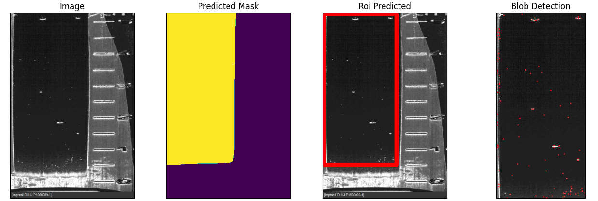

# Automated Spot Detection in Images
A Python package for detecting blobs (spots) in images.

## Installation

```bash
pip install -r requirements.txt
python setup.py install
```

## Background

Our company aims to automate the detection of small spots in a large number of images. This automation will free staff from the tedious work of manually counting these spots, allowing them to focus on more rewarding tasks.

## Problem Definition

Build a model that counts the number of bright white spots in the provided images, quantify its performance, and describe the approach.

## Approach

We have developed a solution using computer vision techniques and deep learning to detect and count bright white spots in images. The process involves the following steps:

1. Image Preprocessing
2. Mask Prediction using a pre-trained model
3. Region of Interest (ROI) Detection
4. Blob Detection within the ROI

### Sample Image Processing



The image above shows the steps of our process:
1. Original Image
2. Predicted Mask
3. ROI Prediction
4. Blob Detection

## Usage


**To use this spot detection solution:**

+ Load your pre-trained model.
+ Create an instance of the BlobDetector class.
+ Call the process_image method with the path to your image.
```python
model = torch.load('path_to_your_model.pth')
detector = BlobDetector(model)
spot_count = detector.process_image('input_image.jpg')
print(f"Number of spots detected: {spot_count}")

```


### Performance Quantification
The performance of this model can be quantified in several ways:

**Accuracy**: Compare the number of detected spots with manually counted spots in a test set.  
**Processing Time**: Measure the time taken to process each image.  
**Precision and Recall**: Calculate these metrics by comparing the detected spots with ground truth data.  

### Conclusion
This automated spot detection solution significantly reduces the manual effort required to count bright white spots in images. It provides a fast and consistent method for analyzing large numbers of images, freeing up staff time for more complex tasks.
The solution is flexible and can be fine-tuned by adjusting parameters such as blob detection thresholds or ROI selection criteria to adapt to different types of images or spot characteristics.
